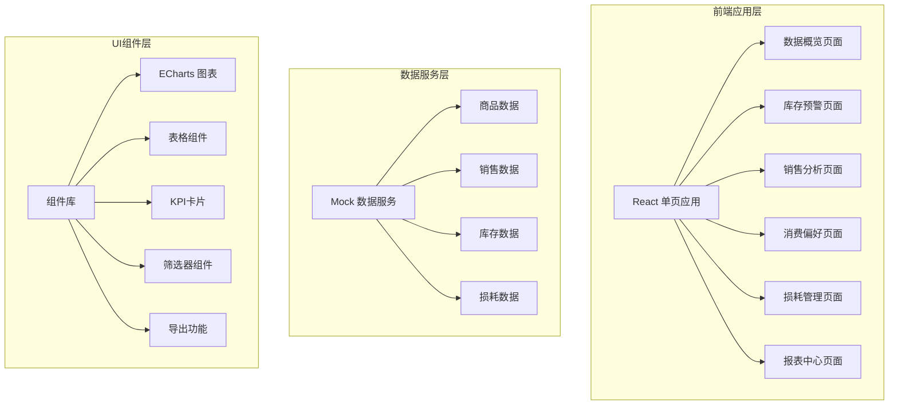
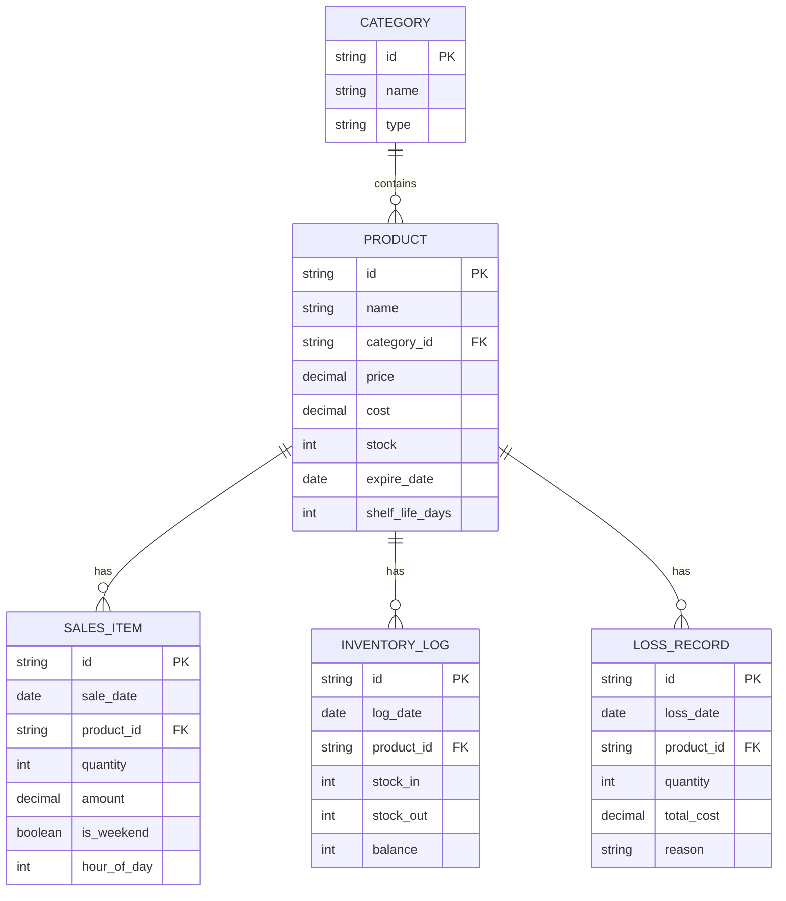

## 1. 架构设计



## 2. 技术选型

- **前端框架**: React@18 + TypeScript
- **构建工具**: Vite@5
- **样式方案**: TailwindCSS@3
- **图表库**: ECharts@5
- **UI组件**: Ant Design@5
- **数据导出**: xlsx (SheetJS)
- **路由管理**: React Router@6
- **状态管理**: Zustand
- **日期处理**: dayjs

## 3. 路由定义

| 路由 | 页面 | 功能 |
|------|------|------|
| / | 数据概览 | 仪表盘KPI展示、进销趋势、品类占比 |
| /inventory | 库存预警 | 临期商品、滞销商品、库存状态 |
| /sales | 销售分析 | 品类营收、毛利率、周度差异 |
| /preference | 消费偏好 | 消费画像、陈列建议 |
| /loss | 损耗管理 | 损耗统计、成本分析 |
| /reports | 报表中心 | 报表导出、同期对比 |

## 4. 类型定义

```typescript
// 商品类型
interface Product {
  id: string;
  name: string;
  category: 'snack' | 'daily' | 'frozen' | 'drink';
  categoryName: string;
  price: number;
  cost: number;
  stock: number;
  expireDate: string;
  shelfLife: number;
  salesLast30Days: number;
  turnoverDays: number;
}

// 销售数据
interface SalesData {
  date: string;
  totalAmount: number;
  orderCount: number;
  categoryBreakdown: {
    category: string;
    amount: number;
    percentage: number;
  }[];
}

// 库存预警
interface InventoryAlert {
  productId: string;
  productName: string;
  type: 'expiring' | 'slow_moving' | 'out_of_stock';
  level: 'warning' | 'danger';
  daysLeft?: number;
  stockValue: number;
}

// 单品分析
interface ProductAnalysis {
  productId: string;
  productName: string;
  category: string;
  revenue: number;
  cost: number;
  profit: number;
  marginRate: number;
  salesVolume: number;
  weekdaySales: number;
  weekendSales: number;
}

// 损耗记录
interface LossRecord {
  id: string;
  date: string;
  productId: string;
  productName: string;
  category: string;
  quantity: number;
  unitCost: number;
  totalCost: number;
  reason: 'expired' | 'damaged' | 'other';
}
```

## 5. 数据模型



## 6. Mock 数据规范

### 6.1 商品数据 (1000+ SKU)
- 四大品类：零食(40%)、日化(25%)、速冻(20%)、酒水(15%)
- 价格区间：零食5-50元，日化10-100元，速冻15-80元，酒水20-300元
- 毛利率：零食25-35%，日化30-45%，速冻20-30%，酒水35-50%

### 6.2 销售数据
- 时间跨度：最近24个月
- 日销售额：8000-20000元
- 周末系数：1.3-1.8倍平日销量
- 高峰时段：11:00-13:00, 17:00-20:00

### 6.3 库存数据
- 临期商品：30天内到期，占库存5-8%
- 滞销商品：30天无销量或周转天数>60天
- 库存预警：安全库存<3天销量
